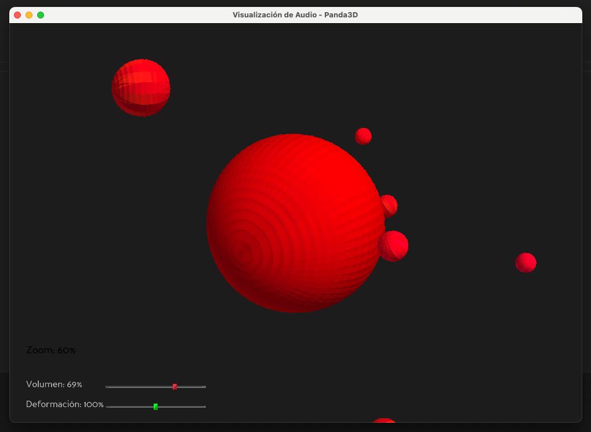

# Panda3D Animación Orgánica

Una aplicación de visualización 3D interactiva que presenta una esfera orgánica que se deforma dinámicamente al ritmo de la música, desarrollada con Panda3D y Python.

Imágenes de ejemplo:



## 🎵 Características

- **Deformación orgánica en tiempo real**: La esfera se deforma siguiendo el ritmo y la amplitud del audio
- **Sincronización de audio**: Compatible con archivos MP3 para una experiencia audiovisual inmersiva
- **Satélites orbitales**: Pequeñas esferas que orbitan alrededor de la esfera principal con movimientos dinámicos
- **Controles interactivos**: Cámara orbital, zoom y controles de audio/deformación
- **Interfaz de usuario**: Sliders para controlar volumen y intensidad de deformación
- **Iluminación avanzada**: Sistema de luces con sombras para mayor realismo

## 🎮 Controles

### Cámara
- **Flechas izquierda/derecha**: Rotar cámara alrededor de la esfera
- **Flechas arriba/abajo** o **W/S**: Zoom in/out
- **Indicador de zoom**: Muestra el porcentaje actual de zoom

### Audio
- **ESPACIO** o **P**: Play/pausa de la música
- **R**: Reiniciar música desde el principio
- **Slider de volumen**: Control deslizante para ajustar el volumen (0-100%)

### Deformación
- **Slider de deformación**: Control deslizante para ajustar la intensidad de la deformación (0-200%)

## 🚀 Instalación

### Prerrequisitos
- Python 3.8 o superior
- Poetry (gestor de dependencias)

### Pasos de instalación

1. **Clonar el repositorio**:
```bash
git clone <url-del-repositorio>
cd panda_3d_animacion
```

2. **Instalar dependencias con Poetry**:
```bash
poetry install
```

3. **Activar el entorno virtual**:
```bash
poetry shell
```

4. **Ejecutar la aplicación**:
```bash
poetry run python panda3d_animacion/main.py
```

## 🎵 Archivos de Audio

La aplicación busca automáticamente archivos MP3 en el directorio del proyecto. Actualmente incluye:
- `blackbird.mp3` - Archivo de audio principal
- `ash.mp3` - Archivo de audio alternativo

Para usar tu propia música, simplemente coloca archivos MP3 en el directorio raíz del proyecto.

## 🛠️ Dependencias

- **Panda3D** (^1.10.11): Motor de juegos 3D para renderizado y gráficos
- **Pygame** (^2.5.0): Biblioteca para manejo de audio y multimedia
- **Python** (^3.8): Lenguaje de programación base

## 🎨 Características Técnicas

### Renderizado
- Esfera procedural con alta densidad de vértices para deformaciones suaves
- Sistema de iluminación direccional con sombras
- Colores dinámicos que cambian con la intensidad del audio

### Audio
- Análisis de amplitud en tiempo real
- Sincronización precisa entre audio y animación
- Control de volumen dinámico

### Animación
- Deformación orgánica basada en funciones sinusoidales
- Movimiento orbital de satélites con colisiones
- Rotación y escalado dinámicos

## 🎯 Estructura del Proyecto

```
panda_3d_animacion/
├── panda3d_animacion/
│   ├── __init__.py
│   ├── main.py              # Aplicación principal
│   └── ash.mp3              # Archivo de audio
├── blackbird.mp3            # Archivo de audio principal
├── pyproject.toml           # Configuración de Poetry
├── poetry.lock              # Dependencias bloqueadas
└── README.md                # Este archivo
```

## 🎪 Cómo Funciona

1. **Inicialización**: La aplicación carga el modelo de esfera y configura el entorno 3D
2. **Carga de audio**: Busca y carga automáticamente archivos MP3 disponibles
3. **Análisis de audio**: Analiza la amplitud del audio en tiempo real usando pygame
4. **Deformación**: Aplica transformaciones a los vértices de la esfera basadas en la amplitud
5. **Renderizado**: Actualiza la escena 60 veces por segundo para una animación fluida

## 🎨 Personalización

### Modificar la deformación
Puedes ajustar los parámetros de deformación en el método `animate_sphere()`:
- Intensidad de la deformación
- Velocidad de las ondas
- Patrones de deformación

### Cambiar colores
Los colores se pueden modificar en la sección de configuración de materiales y luces.

### Agregar efectos
El código está estructurado para facilitar la adición de nuevos efectos visuales y de audio.

## 🐛 Solución de Problemas

### La música no se reproduce
- Verifica que tengas archivos MP3 en el directorio del proyecto
- Asegúrate de que pygame esté correctamente instalado

### Rendimiento lento
- Reduce la densidad de la esfera en `create_basic_sphere()`
- Disminuye el número de satélites en `create_satellites()`

### Problemas de audio
- Verifica que tu sistema tenga drivers de audio funcionando
- Prueba con diferentes archivos MP3

## 📝 Licencia

Este proyecto es de código abierto y está disponible bajo la licencia MIT.

## 🤝 Contribuciones

Las contribuciones son bienvenidas. Por favor:
1. Fork el proyecto
2. Crea una rama para tu feature
3. Commit tus cambios
4. Push a la rama
5. Abre un Pull Request

## 📧 Contacto

Para preguntas o sugerencias, puedes contactar al desarrollador - fmancini.cl@gmail.com

---

¡Disfruta de la experiencia audiovisual! 🎵✨
